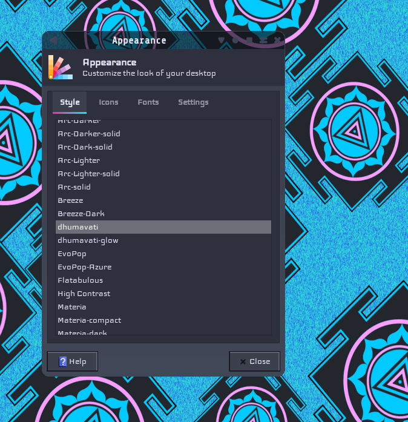
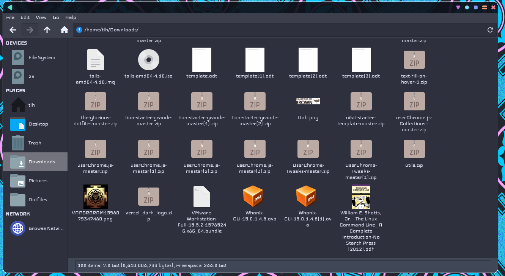
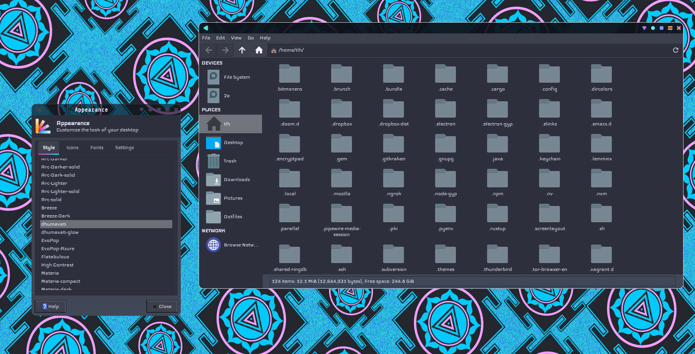

Based on [synthwave](https://github.com/robb0wen/synthwave-vscode) for VS Code with some splashes of Retrofukation.

## Installing & Using
I included a simple and quick installation script to call node dependencies, run gulp build and then install the themes in local and global locations for your GTK-ing pleasure. 
```bash

sudo chmod +x install.sh 

./install.sh 

```
## Screenshots and extras
> Using Paper-Mono-Dark Icons on my Awesomewm Configuration



> **Note** the Window Manager controls are part of the AwesomeWM configuration and not included with the GTK theme.


---
